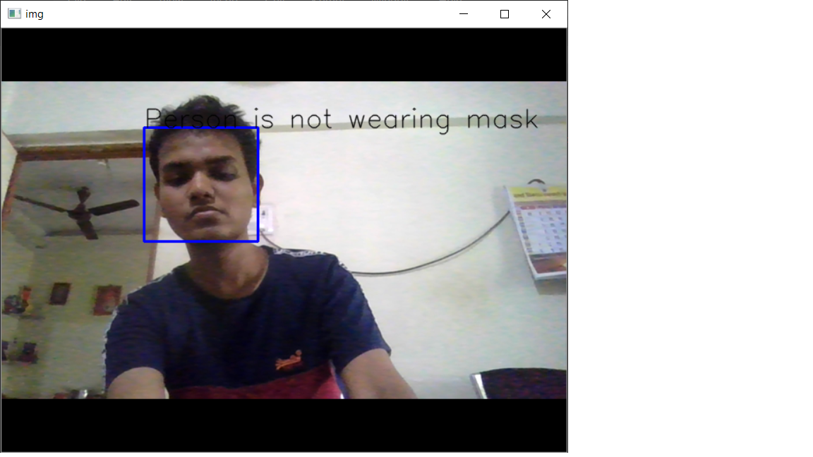
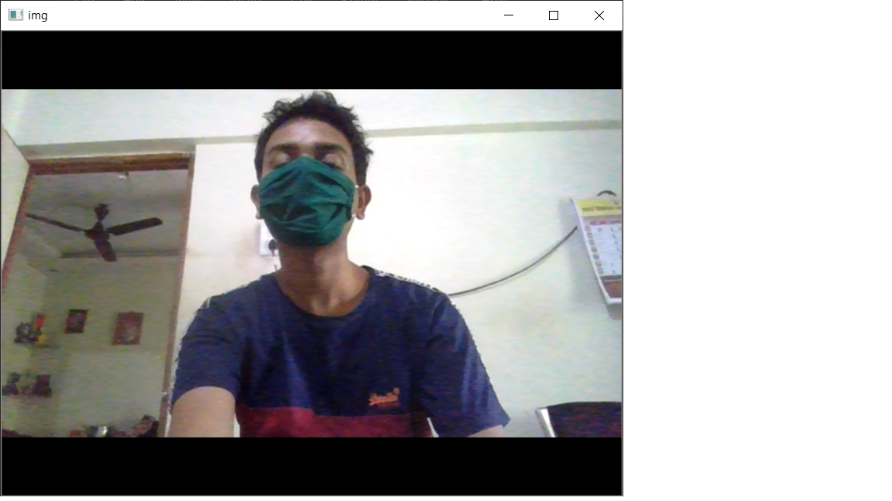
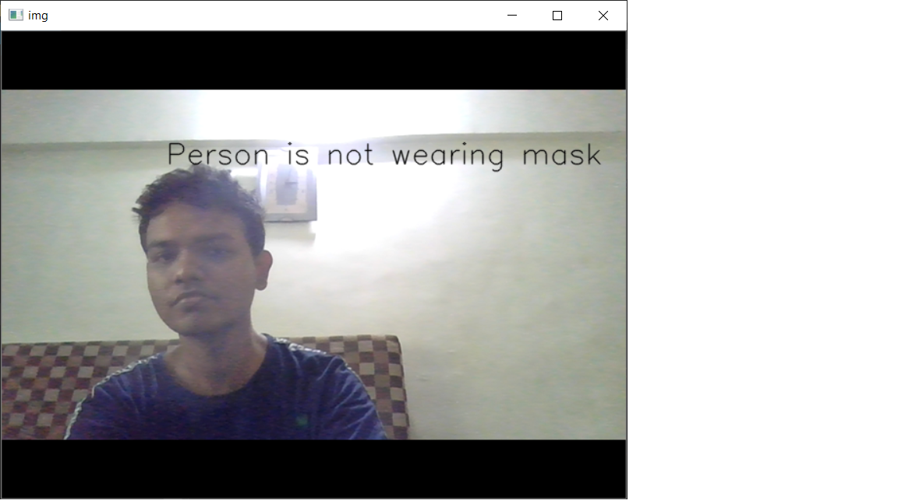
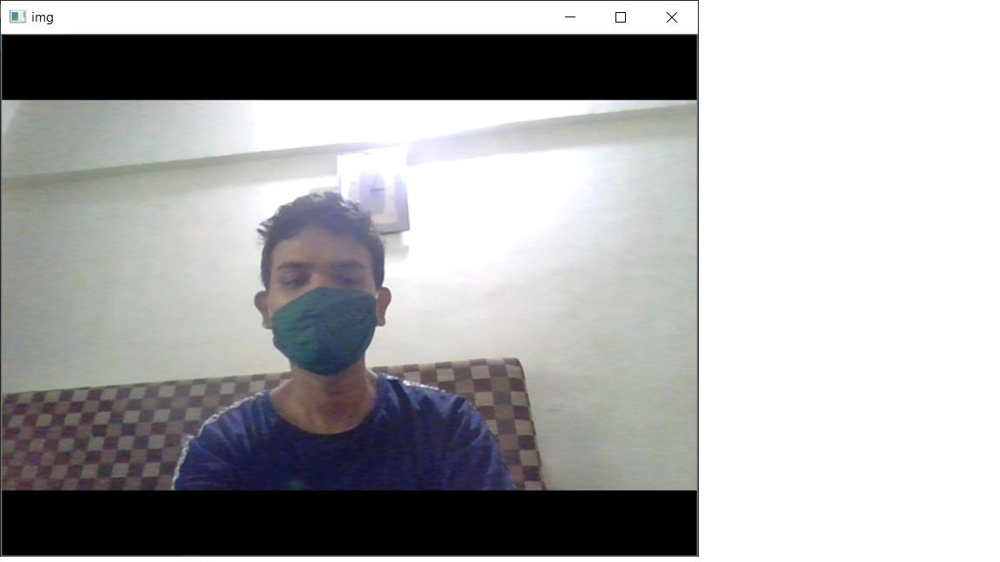

# Face-Mask-detection-

### Table of content

1. [Description](#description)
2. [Requirements](#requirements)
3. [Library](#library)
4. [Steps](#steps)
5. [Conclusion](#conclusion)


<a name="description"></a>
## Description
This is a simple facemask Detection python program.This is based on OpenCV library which is used for image processing.I have worked on 2 approch.
1. Face Detection
2. Nose Detection

OpenCV uses Haar Cascade Classifier for detecting face.
### Haar Cascade Classifier

It is a machine learning based approach where a cascade function is trained from a lot of positive (images with face) and negative images (images without face). The algorithm is proposed by Paul Viola and Michael Jones.

The algorithm has four stages:

1. **Haar Feature Selection:** Haar features are calculated in the subsections of the input image. The difference between the sum of pixel intensities of adjacent rectangular regions is calculated to differentiate the subsections of the image. A large number of haar-like features are required for getting facial features.
2. **Creating an Integral Image:** Too much computation will be done when operations are performed on all pixels, so an integral image is used that reduce the computation to only four pixels. This makes the algorithm quite fast.
3. **Adaboost:** All the computed features are not relevant for the classification purpose. `Adaboost` is used to classify the relevant features.
4. **Cascading Classifiers:** Now we can use the relevant features to classify a face from a non-face but algorithm provides another improvement using the concept of `cascades of classifiers`. Every region of the image is not a facial region so it is not useful to apply all the features on all the regions of the image. Instead of using all the features at a time, group the features into different stages of the classifier.Apply each stage one-by-one to find a facial region. If on any stage the classifier fails, that region will be discarded from further iterations. Only the facial region will pass all the stages of the classifier.  

## Face Detection

Face detection has gained a lot of attention due to its real-time applications. A lot of research has been done and still going on for improved and fast implementation of the face detection algorithm. Why is face detection difficult for a machine? Face detection is not as easy as it seems due to lots of variations of image appearance, such as pose variation (front, non-front), occlusion, image orientation, illumination changes and facial expression.

Here I am applying simple logic that if person is wearing mask his or her face is not detected and Vise versa.
IF code can detect nose means person is not wearing mask.

<a name="requirements"></a>
## Requirements
1.Python 3.6
2.Machine Learning library : OpenCV

<a name="library"></a>
## Library


## OpenCV

OpenCV is an open source computer vision and machine learning software library. It is a BSD-licence product thus free for both business and academic purposes.The Library provides more than 2500 algorithms that include machine learning tools for classification and clustering, image processing and vision algorithm, basic algorithms and drawing functions, GUI and I/O functions for images and videos. Some applications of these algorithms include face detection, object recognition, extracting 3D models, image processing, camera calibration, motion analysis etc.

OpenCV is written natively in C/C++. It has C++, C, Python and Java interfaces and supports Windows, Linux, Mac OS, iOS, and Android. OpenCV was designed for computational efficiency and targeted for real-time applications. Written in optimized C/C++, the library can take advantage of multi-core processing.

<a name="steps"></a>
## Steps
# face detection

1. Download all the files 
2. place all files in one folder.
3. run facemask.py following command ``` python facemask.py```

# nose detection
1. Download all the files 
2. place all files in one folder.
3. run facemask.py


<a name="conclusion"></a>
## Conclusion
# output for Face detection





# output for Nose detection





still need to work for increasing accuracy of detection by implementing parameters on function.


